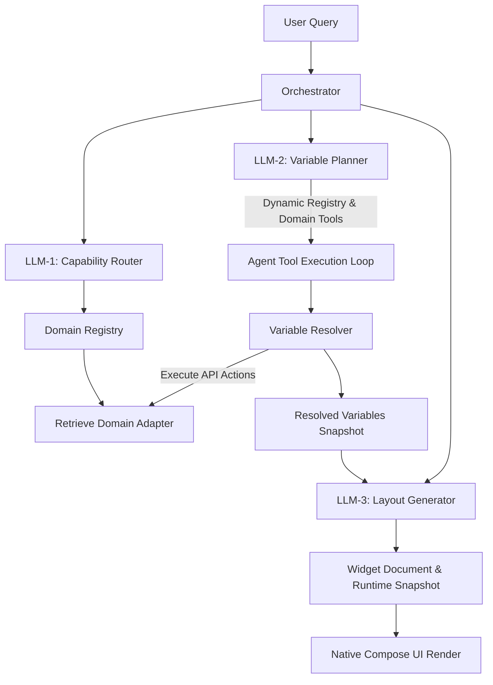
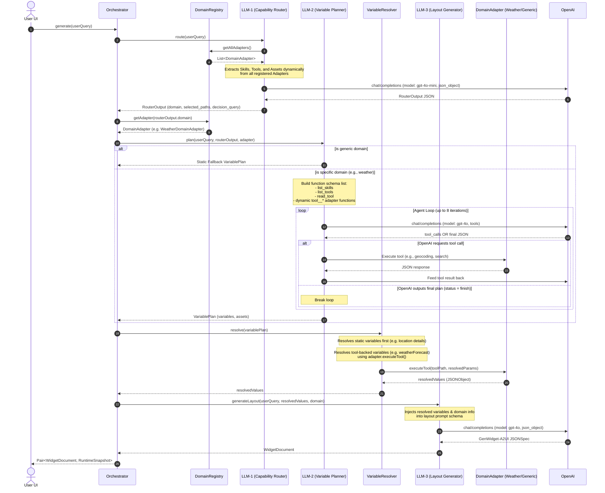
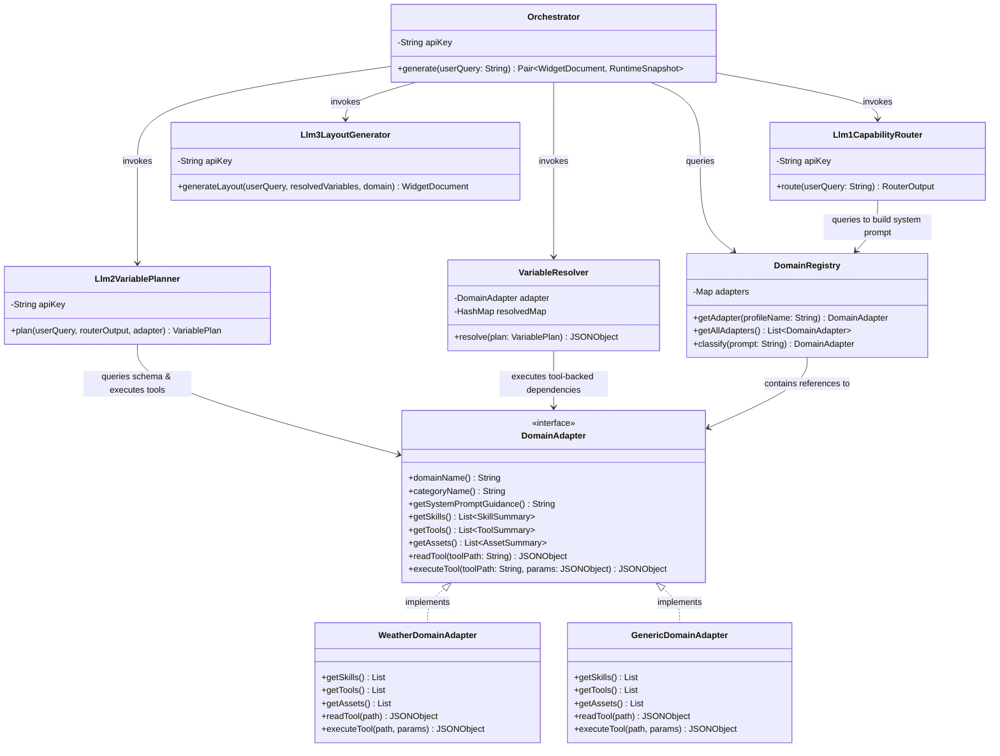

# GenUI Forge Agentic Pipeline: Dependency Graph & Execution Flow

This document details the on-device agent architecture, query propagation sequence, dependency structures, and prompt layouts for the **GenUI Forge** Android client.

---

## 1. Architectural Overview

The core of the application's intelligence is a multi-agent orchestrated pipeline. When a user supplies a natural language request, the system executes three consecutive LLM stages to route, plan, resolve, and generate a dynamic UI.



---

## 2. Sequence Diagram (Query Flow)

The diagram below details the sequence of calls and data transformations for a single user query execution.



---

## 3. Class Diagram & Relationship Hierarchy

The UML diagram illustrates the structural dependencies between components.



---

## 4. Prompt Specifications & Dynamic Variable Placements

### 4.1 LLM-1: Capability Router Prompt
- **Model**: `gpt-4o-mini`
- **Output**: JSON Structure

```text
You are the Capability Router for a plugin-based dynamic widget platform.
Your task is to analyze the user's query and route it to the correct domain by selecting the coarse, domain-level skill, tool, and asset paths.

Available Domain Plugins are listed below:

1. SKILLS (Domain-specific layout rules):
{skillsSection}

2. TOOLS (Domain-specific API capabilities):
{toolsSection}

3. ASSETS (Domain-specific static assets):
{assetsSection}

Rules for Selection:
- Select ONLY domain-level coarse paths listed above. Do NOT select specific files.
- Only route to paths that are highly relevant to the query.
- FALLBACK VIRTUAL DOMAIN: If the query does not match any of the available registry domain plugins listed above, you MUST route the query to the virtual "general" domain:
  * selected_paths.skills = ["/skill/general"]
  * selected_paths.tools = ["/tool/general"]
  * selected_paths.assets = []
  * domain = "generic"
  * is_decision_query = true
- Determine if the query requires analysis, recommendations, advice, or suggestions based on data (e.g. "should I carry an umbrella?"). Set "is_decision_query" = true if it falls under these categories, else false.

You MUST respond with a JSON object containing these keys:
{
  "selected_paths": {
    "skills": ["/skill/weather"],
    "tools": ["/tool/weather"],
    "assets": ["/asset/weather"]
  },
  "domain": "weather",
  "confidence": 1.0,
  "reason": "explanation of routing choice",
  "is_decision_query": boolean
}
```

#### Dynamic System Variables Injected:
- `{skillsSection}`: String constructed by iterating over `DomainRegistry.getAllAdapters()` and formatting each available skill as:
  ```text
  - Coarse Path: "{skill.path}"
    Domain: "{adapter.domainName()}"
    Description: {skill.description}
  ```
- `{toolsSection}`: String constructed by iterating over `DomainRegistry.getAllAdapters()` and formatting each available tool as:
  ```text
  - Coarse Path: "{tool.path}"
    Domain: "{adapter.domainName()}"
    Description: {tool.description}
  ```
- `{assetsSection}`: String constructed by iterating over `DomainRegistry.getAllAdapters()` and formatting each available asset as:
  ```text
  - Coarse Path: "{asset.path}"
    Domain: "{adapter.domainName()}"
    Description: {asset.description}
  ```

---

### 4.2 LLM-2: Variable Planner Prompt
- **Model**: `gpt-4o` (with function definitions)
- **Output**: Function Calls / JSON Structure

```text
You are the Variable Planner for a plugin-based dynamic widget platform.
Your task is to plan the variables and static assets required to render a user widget.

You must determine:
1. What data (variables) needs to be fetched, and which backend tools should fetch it.
2. What static assets are needed.

You should work in an agentic loop:
- Discover available skills/tools in the "{domain}" domain using registry tools: "list_skills", "list_tools", "read_tool".
- Call geocoding/search tools in this planning phase immediately to resolve location coordinates.
- Once resolved, output the final plan.
- Define dynamic variables with a tool-backed source (e.g. "/tool/weather/forecast") with parameters referencing location coordinates.

Format of final plan response:
{
  "status": "finish",
  "variables": [
    {
      "variable_name": "location",
      "variable_type": "object",
      "source": {
        "type": "static",
        "value": {
          "latitude": 42.3601,
          "longitude": -71.0589,
          "name": "Boston"
        }
      }
    },
    {
      "variable_name": "weatherForecast",
      "variable_type": "object",
      "source": {
        "type": "tool",
        "tool_path": "/tool/weather/forecast",
        "parameters": {
          "latitude": "{{location.latitude}}",
          "longitude": "{{location.longitude}}"
        }
      }
    }
  ],
  "assets": ["/asset/weather/icons"]
}

Current Domain: {domain}
```

#### Dynamic System Variables Injected:
- `{domain}`: Retrieved from LLM-1's `RouterOutput.domain` (e.g. `"weather"`).

---

### 4.3 LLM-3: Layout Generator Prompt
- **Model**: `gpt-4o`
- **Output**: Custom JSON layout spec (GenWidget-A2UI format)

```text
You are the Layout Generator (LLM-3) for a dynamic Android widget platform.
Your task is to design a beautiful, modern Android widget layout tree represented as a GenWidget-A2UI JSONSpec document.
Return ONLY a valid JSON object. Do not wrap in markdown tags like ```json ... ```. No comments or explanations.

Top-Level Schema Structure:
- schemaVersion: "0.1"
- kind: "genWidget"
- widgetId: "{domain}_widget"
- metadata: { "title": "{domain_TitleCase} Widget", "category": "{domain}" }
- supportedSizes: { "default": "4x3", "breakpoints": ["4x3"] }
- stateMachine: { "states": { "ready": { "screen": "screen.ready" } } }
- screens: { "screen.ready": { "layouts": { "4x3": "surface.ready.4x3" } } }
- a2uiSurfaces: {
    "surface.ready.4x3": {
        "version": "v1.0",
        "createSurface": {
            "surfaceId": "surface.ready.4x3",
            "catalogId": "genwidget://catalog/android-widget-v1",
            "root": "root_column",
            "components": [
                // Flat list of components
            ]
        }
    }
  }
- preview: {
    "mockData": {resolvedVariables}
  }
  
Component Rules:
- Every component must have a unique "id" (string), "component" (string, e.g. Column, Row, Text, Icon, Spacer, Divider, Image), "fields" (object of properties), and "children" (array of child component IDs).
- Do not nest components. Write a flat array of components. A component links to its children by their IDs.
- Allowed components:
  * Column: fields: "gap" ("xs", "sm", "md", "lg"), "padding" ("xs", "sm", "lg", "md"), "background" ("surface", "transparent"), "cornerRadius" ("sm", "md", "lg")
  * Row: fields: "gap", "align" ("center", "end", "spaceBetween")
  * Text: fields: "text" (BindingExpr), "style" ("titleLarge", "titleMedium", "bodySmall", "labelSmall", "displaySmall"), "color" ("primary", "secondary", "muted", "warning")
  * Icon: fields: "icon" (IconRequest), "size" ("xs", "sm", "md", "lg", "xl"), "color"
  * IconButton: fields: "icon" (IconRequest), "background"
  * Image: fields: "source" (BindingExpr)
  * Spacer: fields: "size" (BindingExpr)
  * Divider
  
BindingExpr Options:
- Binding to path: { "path": "/model/..." }
- Format String: { "formatString": "Text {val}", "args": { "val": { "path": "/model/..." } } }
- Literal String: { "literalString": "Static Text" }
- Literal Number: { "literalNumber": 23.4 }

Live Variables Snapshot available at runtime:
{resolvedVariables}

Weather Guidance (if domain is "weather"):
{weather_guidance_or_generic_guidance}
```

#### Dynamic System Variables Injected:
- `{domain}`: Selected domain name (e.g. `"weather"`).
- `{domain_TitleCase}`: Selected domain name capitalized (e.g. `"Weather"`).
- `{resolvedVariables}`: Direct stringified JSON representing values evaluated by the `VariableResolver` (used for both `preview.mockData` and the live variable snapshot reference).
- `{weather_guidance_or_generic_guidance}`: Substituted depending on selected domain:
  - **Weather**:
    ```text
    - Construct a weather forecast card containing location name, temperature, rain chance, and condition.
    - Provide a row/list of hourly forecast items or daily forecast items. Use "InsightList" component:
      - Fields: "source": { "path": "/model/weather/hourlyItemsToday" } or { "path": "/model/weather/dailyItemsWeek" }, "presentation": "chips" or "list"
    ```
  - **Generic**:
    ```text
    - Map custom prompt details into direct text boxes using {"literalString": "..."} or bind to "/model/generic/..." paths.
    ```
